# Pattern Timeline

These patterns span 80+ years of computing history — from the earliest stored-program computers to modern distributed systems.

```mermaid
timeline
    title When Patterns First Appeared
    ~1943 : State Machine (McCulloch & Pitts)
    ~1945 : Bitmask (von Neumann EDVAC)
    ~1953 : Double Buffering (IBM mainframes)
    ~1956 : Batch Processing (GM-NAA I/O)
    1958 : Free List (McCarthy's LISP)
         : Cooperative Scheduling (Conway's coroutines)
    1959 : Trie (de la Briandais)
    1962 : Dependency Graph / Toposort (Kahn)
    1964 : Min Heap (Williams' heapsort)
    1965 : Semaphore (Dijkstra, THE OS)
    1966 : LRU Cache (Belady, IBM)
    1970 : Bloom Filter (Burton Bloom)
    ~1971 : Copy-on-Write (IBM VM/370)
    1973 : Actor Model (Hewitt, Bishop, Steiger)
         : Retry with Backoff (Metcalfe's Ethernet)
    1974 : Diff / Patch (McIlroy, Unix V5)
         : Backpressure (TCP, Cerf & Kahn)
    1975 : Iterator (Liskov's CLU)
    ~1976 : Write-Ahead Log (IBM System R)
         : Checkpointing (database recovery)
    1978 : MVCC (David Reed, MIT)
    1979 : Observer / Pub-Sub (MVC, Xerox PARC)
    1981 : Work Stealing (Burton & Sleep)
    ~1986 : Rate Limiter / Token Bucket (Turner)
    1989 : Skip List (William Pugh)
    1990 : Flyweight (Calder & Linton)
    ~1994 : Object Pool (Bonwick's slab allocator)
    1997 : Consistent Hashing (Karger et al.)
    2007 : Circuit Breaker (Nygard, "Release It!")
```

## The Full Table

| Year | Pattern | Origin |
|------|---------|--------|
| ~1943 | [State Machine](/patterns/state-machine/) | McCulloch & Pitts modeled neurons as finite automata; Mealy (1955) and Moore (1956) formalized the two canonical types |
| ~1945 | [Bitmask](/patterns/bitmask/) | Inherent to stored-program computers; von Neumann's EDVAC report described bit-level operations |
| ~1953 | [Double Buffering](/patterns/double-buffering/) | Used in IBM 701/709 I/O subsystems to overlap computation with data transfer |
| ~1956 | [Batch Processing](/patterns/batch-processing/) | GM-NAA I/O monitor for IBM 704 — the first documented batch processing system |
| 1958 | [Free List](/patterns/free-list/) | McCarthy's LISP used free lists to manage cons cell allocation |
| 1958 | [Cooperative Scheduling](/patterns/cooperative-scheduling/) | Melvin Conway described coroutines (published 1963), formalizing voluntary yield |
| 1959 | [Trie](/patterns/trie/) | Rene de la Briandais described the trie; Fredkin coined the name "trie" (from retrieval) in 1960 |
| ~1960s | [Ring Buffer](/patterns/ring-buffer/) | Used in telecommunications and real-time I/O systems; no single inventor |
| ~1960s | [Arena Allocator](/patterns/arena-allocator/) | Region-based allocation in compilers; Knuth discussed pool allocation in TAOCP (1968) |
| 1962 | [Dependency Graph](/patterns/dependency-graph/) | Kahn published "Topological sorting of large networks" in CACM |
| 1964 | [Min Heap](/patterns/min-heap/) | Williams invented the binary heap for heapsort; Floyd improved it the same year |
| 1965 | [Semaphore](/patterns/semaphore/) | Dijkstra invented P() and V() for the THE operating system |
| 1966 | [LRU Cache](/patterns/lru-cache/) | Belady's "A study of replacement algorithms for virtual-storage computers" (IBM Systems Journal) |
| 1970 | [Bloom Filter](/patterns/bloom-filter/) | Burton Bloom published "Space/Time Trade-offs in Hash Coding with Allowable Errors" (CACM) |
| ~1971 | [Copy-on-Write](/patterns/copy-on-write/) | IBM VM/370 virtual memory; later adopted by BSD Unix for fork() |
| 1973 | [Actor Model](/patterns/actor-model/) | Hewitt, Bishop, Steiger: "A Universal Modular Actor Formalism for AI" |
| 1973 | [Retry with Backoff](/patterns/retry-backoff/) | Metcalfe's Ethernet introduced truncated binary exponential backoff for CSMA/CD |
| 1974 | [Diff / Patch](/patterns/diff-patch/) | McIlroy created diff for Unix V5 at Bell Labs |
| ~1974 | [Backpressure](/patterns/backpressure/) | TCP flow control (Cerf & Kahn) — the earliest production form of backpressure |
| 1975 | [Iterator](/patterns/iterator/) | Liskov's CLU language introduced iterators as first-class abstractions |
| ~1976 | [Write-Ahead Log](/patterns/write-ahead-log/) | IBM System R, the first SQL relational database; formalized in ARIES (1992) |
| ~1976 | [Checkpointing](/patterns/checkpointing/) | Used alongside WAL in System R for crash recovery; formalized in ARIES |
| 1978 | [MVCC](/patterns/mvcc/) | David Reed's MIT PhD dissertation on multi-version concurrency control |
| 1979 | [Observer](/patterns/observer/) | Reenskaug's MVC pattern at Xerox PARC for Smalltalk |
| 1981 | [Work Stealing](/patterns/work-stealing/) | Burton & Sleep described task stealing for parallel graph reduction |
| ~1986 | [Rate Limiter](/patterns/rate-limiter/) | Turner described the leaky bucket for network traffic shaping |
| 1989 | [Skip List](/patterns/skip-list/) | Pugh: "Skip Lists: A Probabilistic Alternative to Balanced Trees" (CACM) |
| 1990 | [Flyweight](/patterns/flyweight/) | Calder & Linton: "Glyphs: Flyweight Objects for User Interfaces" (USENIX) |
| ~1994 | [Object Pool](/patterns/object-pool/) | Bonwick's slab allocator for Solaris; database connection pooling popularized it |
| 1997 | [Consistent Hashing](/patterns/consistent-hashing/) | Karger et al.: "Consistent Hashing and Random Trees" (STOC) |
| 2007 | [Circuit Breaker](/patterns/circuit-breaker/) | Nygard described it in "Release It!" — borrowed from electrical engineering |

> **Note:** Dates marked with ~ are approximate — these concepts emerged organically from engineering practice rather than a single publication.

## What This Tells Us

1. **The fundamentals are OLD.** Semaphores (1965), heaps (1964), and state machines (1943) have been battle-tested for 60-80 years. When you use them, you're standing on decades of proven engineering.

2. **Most "new" patterns are compositions.** React's reconciler (2017) composes bitmask + min heap + cooperative scheduling + diff/patch + double buffering — all invented between 1943 and 1974.

3. **The gap between invention and widespread adoption is shrinking.** Bloom filters took 30 years from paper (1970) to widespread use in databases (2000s). Circuit breakers took only 5 years from book (2007) to Netflix Hystrix (2012).

4. **Patterns outlive the technologies that popularized them.** Copy-on-Write was invented for IBM mainframes in 1971 — it's now in Git, Rust, and every modern OS kernel.
