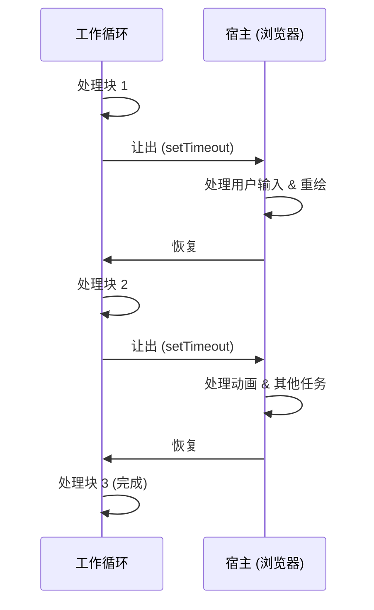

# 模式：协作调度 (Cooperative Scheduling)

## 一句话

将长时间运行的任务拆分为小块，在每块之间让出控制权，以保持系统响应。

## 核心思想

在协作调度中，任务主动检查是否应该暂停并让其他工作运行。与抢占式调度（由操作系统强制中断）不同，协作调度依赖任务自身在安全点让出。



模式：运行循环，每个工作单元后检查截止时间，超时则 `yield`。

## 生产验证

| 项目 | 源码 | 用途 |
|------|------|------|
| React | [Scheduler.js#L188-L258](https://github.com/facebook/react/blob/main/packages/scheduler/src/forks/Scheduler.js#L188-L258) | `workLoop` 从最小堆中处理任务，每轮调用 `shouldYieldToHost()`（~行447）检查 5ms 时间片是否耗尽。 |
| Go Runtime | [proc.go#L4143-L4200](https://github.com/golang/go/blob/master/src/runtime/proc.go#L4143-L4200) | `schedule()` 是调度器主循环。`Gosched()`（行394）是主动让出点，`goschedImpl`（行4315）处理协作式上下文切换。 |

## 实现

::: code-group

```typescript [TypeScript]
type Task = () => boolean; // 返回 true 表示还有更多工作

function createScheduler(yieldInterval: number = 5) {
  const queue: Task[] = [];
  let isRunning = false;

  function shouldYield(startTime: number): boolean {
    return performance.now() - startTime >= yieldInterval;
  }

  function workLoop(): void {
    const startTime = performance.now();
    while (queue.length > 0) {
      if (shouldYield(startTime)) {
        setTimeout(workLoop, 0); // 让出后继续
        return;
      }
      const task = queue[0]!;
      if (!task()) queue.shift();
    }
    isRunning = false;
  }

  return {
    scheduleTask(task: Task) {
      queue.push(task);
      if (!isRunning) {
        isRunning = true;
        setTimeout(workLoop, 0);
      }
    },
  };
}
```

```rust [Rust]
use std::time::{Duration, Instant};

pub struct CooperativeScheduler {
    yield_interval: Duration,
}

impl CooperativeScheduler {
    pub fn new(yield_ms: u64) -> Self {
        CooperativeScheduler {
            yield_interval: Duration::from_millis(yield_ms),
        }
    }

    pub fn run<F>(&self, mut work_units: Vec<F>) -> Vec<F>
    where
        F: FnMut() -> bool,
    {
        let start = Instant::now();
        while !work_units.is_empty() {
            if start.elapsed() >= self.yield_interval {
                return work_units; // 让出：返回剩余工作
            }
            if (work_units[0])() {
                work_units.remove(0);
            }
        }
        work_units
    }
}
```

```go [Go]
package scheduling

import "time"

type Task func() bool

type Scheduler struct {
	YieldInterval time.Duration
	queue         []Task
}

func (s *Scheduler) WorkLoop() bool {
	start := time.Now()
	for len(s.queue) > 0 {
		if time.Since(start) >= s.YieldInterval {
			return false // 让出
		}
		if s.queue[0]() {
			s.queue = s.queue[1:]
		}
	}
	return true // 全部完成
}
```

:::

## 练习

| 难度 | 练习 | 文件 |
|------|------|------|
| 基础 | 实现带让出检查的时间片工作循环 | `exercises/typescript/cooperative-scheduling/01-basic.test.ts` |
| 进阶 | 构建按优先级调度并让出的调度器 | `exercises/typescript/cooperative-scheduling/02-priority-scheduler.test.ts` |

## 何时使用

- **UI 线程工作** — 处理大数据集时保持动画和输入响应
- **批处理** — 分块处理元素，中间暂停让其他系统工作运行
- **长计算** — 将递归树遍历或列表操作拆为可恢复的块
- **并发运行时** — 实现绿色线程或协程调度

## 何时不用

- **短任务** — 如果工作在 1ms 内完成，让出的开销不值得
- **实时保证** — 协作调度无法保证截止时间；使用抢占式调度
- **CPU 密集且无交互** — 如果没有其他东西需要线程，让出浪费时间
- **`requestIdleCallback` 足够时** — 对于非紧急工作，浏览器内置 API 可能就够了

## 更多生产案例

- [Lua](https://github.com/lua/lua) — coroutines
- Python [asyncio](https://github.com/python/cpython/tree/main/Lib/asyncio)
- Erlang/BEAM VM — reduction counting
- Unity — coroutines

## 挑战题

::: details Q1: React yields every 5ms. What happens if you increase this to 50ms? What if you decrease it to 0.5ms?
**Answer:** 50ms causes visible UI jank (3 dropped frames at 60fps); 0.5ms wastes most time on yield overhead instead of useful work.

The 5ms target is a sweet spot: short enough that a frame's 16ms budget still has room for browser paint and input handling, but long enough that the scheduler does meaningful work per slice. At 50ms, user input and animations freeze noticeably. At 0.5ms, the overhead of checking the clock, scheduling a `MessageChannel` callback, and re-entering the work loop dominates — you spend more time scheduling than working.
:::

::: details Q2: A cooperatively scheduled task has a bug where it never returns `true` (never signals completion). What happens to the system?
**Answer:** The task monopolizes every time slice forever, starving all other queued tasks.

Unlike preemptive scheduling, the scheduler cannot forcibly remove a misbehaving task. The work loop gives the buggy task CPU time every slice, it runs for 5ms, yields, gets picked up again — endlessly. Other tasks in the queue never execute. This is the fundamental weakness of cooperative scheduling: it trusts tasks to behave. Production schedulers mitigate this with timeouts or starvation detection that can cancel or deprioritize stuck tasks.
:::

::: details Q3: Why does React use `MessageChannel` instead of `setTimeout(fn, 0)` for yielding?
**Answer:** `setTimeout(fn, 0)` has a minimum 4ms delay enforced by browsers after several nested calls, making it too slow for 5ms time slices.

After about 5 nested `setTimeout` calls, browsers clamp the delay to at least 4ms (HTML spec). This means a 5ms time slice followed by a 4ms yield gap wastes nearly half the time. `MessageChannel` posts a macrotask without the 4ms clamping — the browser can interleave paint and input handling between macrotasks, then dispatch the callback typically in under 1ms. This keeps the scheduler responsive without wasting idle time on artificial delays.
:::

::: details Q4: A colleague says "just use Web Workers instead of cooperative scheduling — they run in parallel." Why isn't this a replacement?
**Answer:** Web Workers cannot access the DOM, so they cannot perform UI rendering work like React's reconciliation.

React's cooperative scheduling exists specifically because reconciliation must read and write DOM state, which is only available on the main thread. Workers are great for pure computation (parsing, compression, image processing), but any task that touches the DOM, measures layout, or updates the UI must run on the main thread. Cooperative scheduling is how you share that single thread fairly among rendering, input handling, and application logic.
:::
