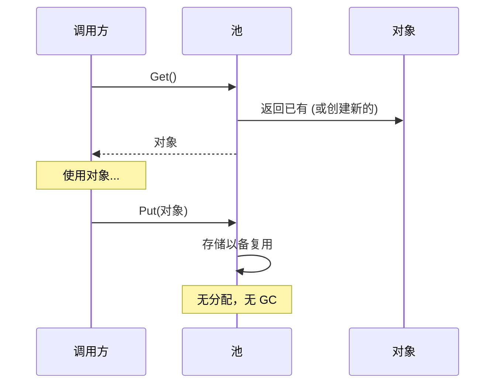

# 模式：对象池 (Object Pool)

## 一句话

预分配一组可复用对象，避免热路径上重复分配和垃圾回收的开销。

## 核心思想

创建和销毁对象很昂贵——内存分配、构造逻辑、GC 压力。对象池维护一组预初始化的对象。需要时"获取"，用完"归还"而不是丢弃。



核心权衡：内存占用（空闲对象占着池）vs CPU/GC 节省（热路径零分配）。

## 生产验证

| 项目 | 源码 | 用途 |
|------|------|------|
| Go 标准库 | [pool.go#L52-L97](https://github.com/golang/go/blob/master/src/sync/pool.go#L52-L97) | `sync.Pool` — `Get()`（行132）先从 per-P 本地池取（无锁），回退到从其他 P 偷取。广泛用于 `fmt`、`encoding/json`、HTTP 处理器。 |
| Godot 引擎 | [pooled_list.h#L35-L100](https://github.com/godotengine/godot/blob/master/core/templates/pooled_list.h#L35-L100) | `PooledList` — 基于 freelist 的对象池，元素在连续页中分配并通过 freelist 回收，避免每帧为实体、粒子、物理体分配内存。 |

## 实现

::: code-group

```typescript [TypeScript]
class ObjectPool<T> {
  private pool: T[] = [];
  private factory: () => T;
  private reset: (obj: T) => void;

  constructor(factory: () => T, reset: (obj: T) => void, initialSize = 0) {
    this.factory = factory;
    this.reset = reset;
    for (let i = 0; i < initialSize; i++) this.pool.push(factory());
  }

  get(): T {
    return this.pool.length > 0 ? this.pool.pop()! : this.factory();
  }

  release(obj: T): void {
    this.reset(obj);
    this.pool.push(obj);
  }
}
```

```go [Go]
import "sync"

var bufPool = sync.Pool{
	New: func() any { return make([]byte, 0, 4096) },
}

func Process(data []byte) []byte {
	buf := bufPool.Get().([]byte)
	buf = buf[:0]
	buf = append(buf, data...)
	result := make([]byte, len(buf))
	copy(result, buf)
	bufPool.Put(buf)
	return result
}
```

```python [Python]
class ObjectPool:
    def __init__(self, factory, reset, initial=0):
        self._factory = factory
        self._reset = reset
        self._pool = [factory() for _ in range(initial)]

    def get(self):
        return self._pool.pop() if self._pool else self._factory()

    def release(self, obj):
        self._reset(obj)
        self._pool.append(obj)
```

:::

## 练习

| 难度 | 练习 | 文件 |
|------|------|------|
| 基础 | 实现通用对象池 get/release | `exercises/typescript/object-pool/01-basic.test.ts` |
| 进阶 | 构建带最大连接数的连接池 | `exercises/typescript/object-pool/02-connection-pool.test.ts` |

## 何时使用

- **高频分配** — 游戏循环、请求处理、粒子系统
- **昂贵构造** — 数据库连接、线程上下文、大缓冲区
- **GC 敏感** — 实时系统、游戏引擎、低延迟服务

## 何时不用

- **廉价对象** — 如果分配快且 GC 不是问题，池增加了不必要的复杂性
- **不可变对象** — 池只对需要重置的可变对象有意义
- **小规模** — 少量对象时，池的开销超过节省

## 更多生产案例

- Java `ThreadPoolExecutor`
- .NET `ArrayPool<T>`
- [HikariCP](https://github.com/brettwooldridge/HikariCP) — JDBC connection pool
- Unity `ObjectPool<T>`

## 挑战题

::: details Q1: Your pool is initialized with 10 objects, but at peak load you need 100. Should the pool grow dynamically or reject requests beyond 10?
**Answer:** It depends on the resource type. Grow dynamically for cheap objects (buffers); enforce a hard cap for expensive/limited resources (database connections).

A buffer pool should grow on demand and optionally shrink during idle periods — the cost of allocating an extra buffer is low. A database connection pool should enforce `maxSize` because each connection consumes server memory, file descriptors, and auth state. Requests beyond the cap should queue and wait (with a timeout) rather than creating unbounded connections that crash the database. HikariCP defaults to a max of 10 connections for this reason.
:::

::: details Q2: A developer calls `pool.get()` but never calls `pool.release()`. How does this "object leak" manifest, and how can you detect it?
**Answer:** The pool gradually empties and starts allocating new objects every time, defeating its purpose and potentially exhausting resources.

Detection strategies: (1) track outstanding objects with a Set and log warnings when count exceeds a threshold, (2) use weak references and a finalizer to detect objects that were GC'd without being returned, (3) wrap pooled objects in a proxy that auto-releases after a timeout. Go's `sync.Pool` sidesteps this entirely — it offers no guarantees about object retention and lets the GC reclaim idle pool entries, making leaks less catastrophic but the pool less predictable.
:::

::: details Q3: Two goroutines call `pool.Get()` simultaneously. What makes Go's `sync.Pool` safe here without an explicit mutex around every get/put?
**Answer:** `sync.Pool` uses per-P (per-processor) local pools with lock-free access, falling back to a shared pool with a mutex only when the local pool is empty.

Each OS thread (P in Go's scheduler) has its own private pool slot. `Get()` first checks the local slot (no lock needed — only one goroutine runs on a P at a time). If empty, it steals from other Ps' pools under a lock. `Put()` goes to the local slot first. This per-P sharding pattern minimizes contention. For a hand-rolled pool in a multithreaded environment, you would need a mutex or a lock-free data structure like a concurrent stack.
:::

::: details Q4: You build an object pool for HTTP request objects in a Node.js server. After profiling, you discover it's slower than just using `new Request()`. What went wrong?
**Answer:** In V8's generational GC, short-lived small objects are allocated and collected almost for free — the pool's reset logic and bookkeeping cost more than the allocation it avoids.

V8's young generation GC uses bump-pointer allocation (essentially free) and collects short-lived objects by copying survivors, not scanning garbage. If your `Request` objects are small, created per-request, and discarded immediately, GC handles them efficiently. The pool adds overhead: maintaining the free list, resetting object state, preventing V8 from optimizing object shapes. Object pools shine for expensive constructors (DB connections, compiled regexes) or GC-pause-sensitive contexts (game loops), not for cheap objects in a modern GC runtime.
:::
